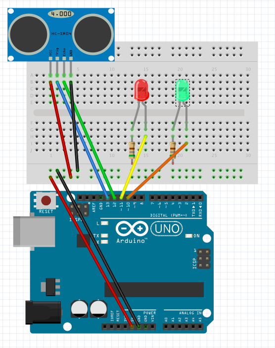

# Proximity Sensor

## Materials

  - Arduino UNO
  - HC-SR04 Ultrasonic Sensor
  - Red and yellow leds
  - Two 560 ohm resistors
  - Hookup Wires

## Objective
Start using a HC-SR04 to meassure distances. Will display the data in the serial monitor.
Will use leds to indicate that the object in front of the sensor is near a certain distance. Red if its too close, green if it's good.
 
## Diagram
