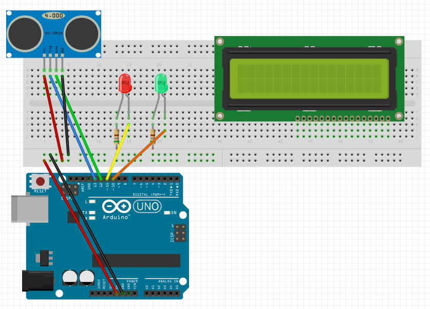

# Proximity Sensor with a LCD display

## Materials

  - Arduino UNO
  - HC-SR04 Ultrasonic Sensor
  - Red and yellow leds
  - Two 560 ohm resistors
  - Hookup Wires

## Objective
Display the proximity sensor data on a LCD screen.

 
## Diagram
